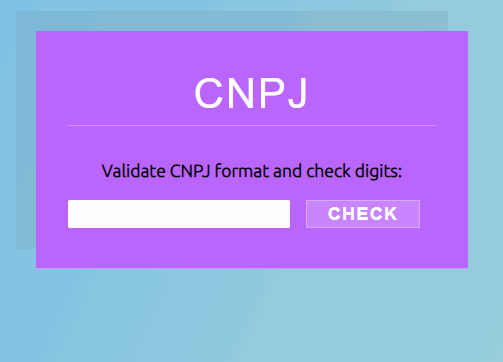
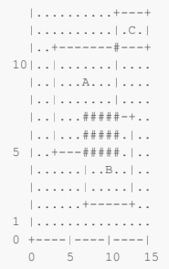
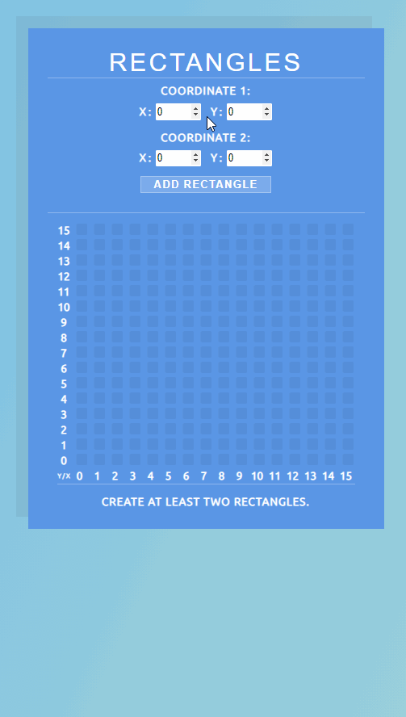
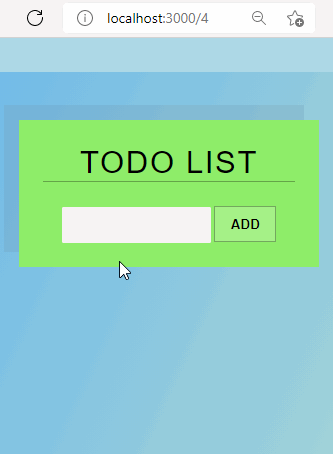
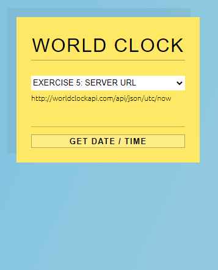
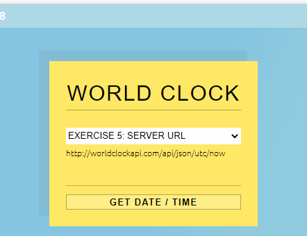
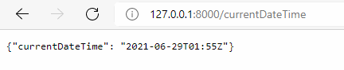
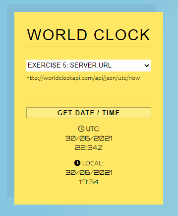
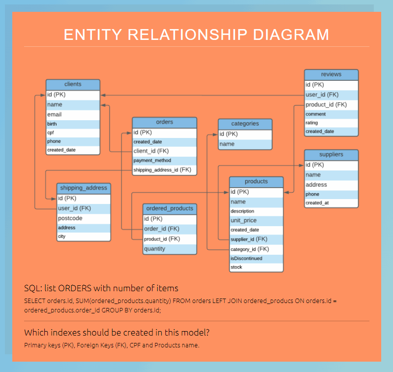
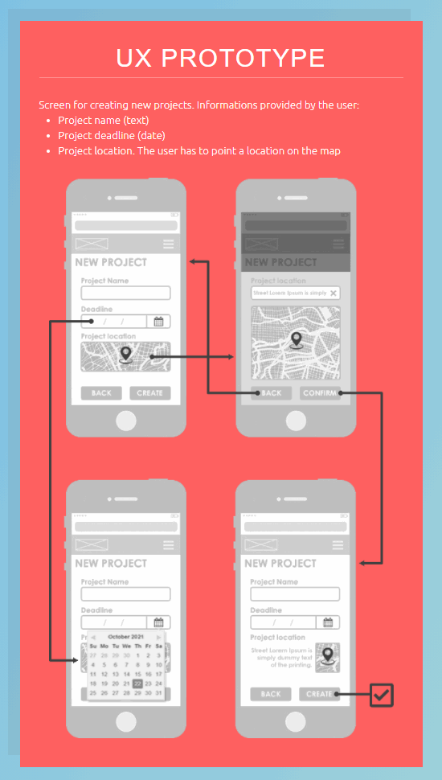

uuidv4 - https://www.npmjs.com/package/uuidv4 - Generate keys
fontawesome - https://fontawesome.com/ - Icons
axios - https://www.npmjs.com/package/axios - fetch data
react-router-dom - https://reactrouter.com/web/guides/quick-start
bootstrap - npm install bootstrap

# Kaffa Mobile :iphone:
Pre-qualification test (v1.10)

#### Description:
My solutions were made using *React*, mainly, and *Django* (REST Server Exercise).
I made a single application that holds all solutions as different components.
Some exercises had similar ideas so I merged them:

* Exercise 1 and Exercise 2;
* Exercise 5 and Exercise 6.

I added the solution to Exercises 7 and 8 to the APP as well, even it being documentation only.
Before testing solution 6 it is necessary to run the REST Server [WorldClockAPI](https://github.com/DougFelix/ReactKaffa#django---python)

# `Getting Started`

Instructions on how to build and run the solutions.
##### `Clone Repository: https://github.com/DougFelix/ReactKaffa`

### :round_pushpin: Create React App

This project was bootstrapped with [Create React App](https://github.com/facebook/create-react-app).

Change to project directory:
##### `cd kaffamobile`

Install node modules:
##### `npm install`

In the project directory, run:
##### `npm start`

It runs the app in the development mode.\
Open [http://localhost:3000](http://localhost:3000) to view it in the browser.

The page will reload if you make edits.\
You will also see any lint errors in the console.

### :round_pushpin: Django - Python

Install [Python and pip](https://www.python.org/downloads/).

Install Django:
##### `pip3 install Django`

Install CORS Headers allows the resources from the server to be accessed on other domains (React App - Solution 6).
##### `pip install django-cors-headers`

Change to Server directory:
##### `cd WorldClockAPI`

Start Server
##### `python manage.py runserver`

## Solucion 1 - :pager: Validade CPNJ

:file_folder: ./ReactKaffa/kaffamobile/src/Components/ValidadeCNPJ/

#### Exercise:

**1** - Validate CNPJ format and check digits
Given a string, check if it looks like a CNPJ, considering two formats:
Formatted:
"00.000.000/0000-00"
Number only:
"00000000000000"
Validate if it's a well-formed CNPJ, considering the "check digits", as defined by Receita Federal.
Important: Don't use a library. You should write the validation code.

#### Description:

  

## Solucion 2 and 3 - :black_square_button: Two Rectangles

:file_folder: ./ReactKaffa/kaffamobile/src/Components/TwoRectangles/

#### Exercise:

  

**2** - Considering two rectangles in a discrete grid (like pixels in a display), each defined by two points, return
true if they intersect, false otherwise.
Note: the points are included in the rectangle and have a dimension of 1 unit; the rectangle (0, 0; 1, 1) have an
area of 4 units.

Example:
A = (3, 5; 11, 11)
B = (7, 2; 13, 7)
C = (11, 11; 15, 13)
intersects(A, B) => true
intersects(A, C) => true
intersects(B, C) => false   

**3** - Considering two rectangles in a discrete grid (like pixels in a display), each defined by two points, compute
the area of intersection between the two.
Note: the points are included in the rectangle and have a dimension of 1 unit; the rectangle (0, 0; 1, 1) have an
area of 4 units.

Example:
A = (3, 5; 11, 11)
B = (7, 2; 13, 7)
C = (11, 11; 15, 13)
areaOfIntersection(A, B) = 15
areaOfIntersection(A, C) = 1

#### Description:

  

## Solucion 4 - :ballot_box_with_check: ToDo List

:file_folder: ./ReactKaffa/kaffamobile/src/Components/TodoList/

#### Exercise:

**4** - Simple Todo List
Todo list application that permits the creation and deletion of tasks (texts).
The application must persist the tasks between executions;
Use any storage you want: database, files, PaaS backends (Firebase, etc.);

#### Description:

  

## Solucion 5 and 6 - :clock2: World Clock

:file_folder: ./ReactKaffa/kaffamobile/src/Components/WorldClock/

#### Exercise:

**5** - Rest Client - World Clock
Application that queries a server and displays the current date/time hour in local and UTC timezones.
Server URL: http://worldclockapi.com/api/json/utc/now

**6** - Rest Server - World Clock
REST server returning a JSON like:
{
    "currentDateTime":"2019-08-12T14:40Z"
}

#### Description:

  

  

  

  

## Solucion 7 - :clipboard: Entity Relationship Diagram - Simple Order Manager

:file_folder: ./ReactKaffa/kaffamobile/src/Components/ERDiagram/

#### Exercise:

**7** - Entity Relationship Diagram - Simple Order Manager
Design the model of a simple Order Manager System.
The system consists of:
* Clients
* Products
* Orders
* Any other tables you may need

You can draw, describe, or list the tables as SQL.
Extras:
* SQL: list ORDERS with number of items
* Which indexes should be created in this model?

Note: this exercise is documentation only - there's no executable to run in this case.

#### Description:

  

## Solucion 8 - :construction: UX Prototype - New Project Screen

:file_folder: ./ReactKaffa/kaffamobile/src/Components/UXPrototype/

#### Exercise:

**8** - UX - Prototype (Optional - Designers / frontend developers only)
Suppose you are working on an app that uses maps for managing and designing new electric networks
(poles, wire segments, transformers, substations...). The user of your app needs to create a project in order
to design new elements in the electric network.
Design and prototype a screen for creating new projects. Each project needs to have the following
informations, provided by the user:
* Project name (text)
* Project deadline (date)
* Project location. The user has to point a location on the map

Note: You can use any tools you want for drawing and prototyping, even pencil and paper. The result of this
test does not need to be an interactive prototype. You can share just screenshots or pictures of your
design.

#### Description:

  

